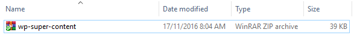

# 10 Billions Data Records

Cũng không có gì lạ khi mọi người thắc mắc `10B records` làm sao mà có thể xử lý được. Cơ bản là mọi người chưa có cơ hội tiếp xúc với công ty có dữ liệu lên tới mức đó.

Thậm chí từ lúc ra đi làm cho công ty tới giờ mình cũng `chưa bao giờ` gặp được trường hợp nào dữ liệu lên tới 10B. Cùng lắm khi join các table lại với nhau thì dữ liệu mới lên tới mức đó. Nhưng nếu join các table lại với nhau để lấy 10B records thì chắc hẳn bạn là 1 `database killer` theo đúng nghĩa đen.

## Nguyên nhân

Cách đây tầm 3 năm về trước, khi mình còn làm cái được gọi là `Amazon Affiliate Program`, có nghĩa là bạn bán được sản phẩm cho Amazon thì bạn sẽ được Amazon trả hoa hồng quảng cáo.

Thì khoảng thời gian đó rất nhiều người tham gia và đã trở thành tỷ phú cho tới giờ. Rất tiếc mình tham gia quá trể nên chả kiếm được bao nhiêu thì trend sập.

## Cách thức hoạt động

1. Khách hàng search Google với từ khóa liên quan tới sites của mình.
2. Sites của mình nằm top 10 Google.
3. Khách hàng click vào site đọc nội dụng.
4. Bấm vào link affiliate dẫn tới trang Amazon để để mua hàng nếu khách hàng thích thú với sản phẩm.
5. Sau khi khách hàng mua sản phẩm thông qua link affiliate từ sites của mình thì Amazon trả tiền hoa hồng cho mình.

## Làm cách nào để sites lên top 10 Google

Khoảng thời gian đó thuật toán Google chú trọng vào độ dài của content trong bài viết. Thì Mình build nó thành 1 bài viết mẫu với độ dài tầm 4000 - 5000 từ. Tất cả các bài viết đều giống nhau tới 80% chỉ khác nhau vài chổ mà mình đánh dấu là `keyword` để nó thay đổi theo ý của mình.

Thậm chí mình bắt đầu nghĩ tới việc viết AI để tạo content ngon hơn đề phòng Google sau này nhận biết được `spam content`, mà thật ra nó chính là `spam content`, haha..

## Server

Bắt đầu vào phần quan trọng. Lúc đó Google cho xài thử free `$300` với các dịch vụ cloud trong 2 tháng đối với mỗi `tài khoản mới`. Không chỉ là Google Cloud mà còn xài cả Azure Cloud luôn và cũng free `$300` trong 2 tháng. Thì cấu hình server mà mình chọn là:

| CPU     | RAM  | SSD | Price    |
| ------- | ---- | --- | -------- |
| 32 Core | 64GB | 2TB | ~ `$150` |

Do là SSD nên mình tạo `swap` thêm `100GB` nữa là tổng RAM là `164GB`. Còn dư tới `1.9TB` disk space. Với cấu hình này thì xài trong 2 tháng là vừa hết `$300` free.

## Platform

Wordpress là sự lựa chọn tốt nhất để `hit & run` + 100 domains `.xyz`. Lúc đó Uniregistry vừa mở bán domain `.xyz` với giá `$0.01`/domain (giờ là không có chuyện đó đâu ha).

Tất nhiên là dựng `multisite`, kết hợp với plugin [https://wordpress.org/plugins/multisite-clone-duplicator]()

## Database

Tới cái phần mà mọi người đang mong chờ đây, haha.. Thật ra mình cũng không ngờ nó lại lên tới `10B records` dựng xong lúc đó mới biết:

Cấu trúc database khi cài Wordpress nó không thể đáp ứng được. Cho nên mình phải custom cái cấu trúc của table `wp_posts` lại.

100 domains với mỗi domain là `100m records`. Mỗi domain như vậy sẽ generate bài viết cho khoản 50k - 100k sản phẩm với danh sách `keyword chính` và vài ngàn `keyword phụ`.

Thì theo công thức (mình lấy trung bình giữa `50k - 100k sản phẩm` là `80k`, và trung bình `2k keyword phụ` thôi):

| Số sản phẩm | Phép tính | Số keywords | Tổng bài viết |
| ----------- | --------- | ----------- | ------------- |
| 80,000      | x         | 2,000       | 160,000,000   |

Và tổng số records cho 100 domains là:

| Số bài viết | Phép tính | Số domains | Tổng records   |
| ----------- | --------- | ---------- | -------------- |
| 160,000,000 | x         | 100        | 16,000,000,000 |

Mà không tới 16B đâu, tầm 11B - 12B là cùng à :v. Nó ngốn tới gần `1.3TB` hay `1.4TB` gì đó mình không nhớ rỏ nữa.

## Chia tables

Ứng với mỗi domain sẽ là 1 table chứa `100m records` thì với lượng records này đỡ hơn `10B` rồi nhưng vẫn phải optimize nó thêm. Để tăng tốc độ query thì mình áp dụng `Partitioning` của MySQL các bạn có thể tìm hiểu tại đây:

MySQL Partitioning: [https://dev.mysql.com/doc/refman/8.0/en/partitioning.html]()

Thì khi áp dụng vào mình cắt được `100m records` ra khi query:

| Số bài viết | Phép tính | Số keyword phụ | Trung bình records khi select |
| ----------- | --------- | -------------- | ----------------------------- |
| 100,000,000 | /         | 2,000          | 50,000                        |

> Lưu ý ở đây là mình hash theo `keyword chính` và `keyword phụ` sẽ đi theo kèm theo nó để đề phòng khách hàng search trên site của mình thôi :v

Không chia partition ra là ăn lol với 100m ngay :v

Mà cái mình mong muốn là link trực tiếp từ Google vào trang sản phẩm của site mình và khách hàng bấm vào link affiliate qua trang Amazon :v

## Sitemap

Đối với số lượng link cho 1 `sitemap page` tốt nhất là 50k thì theo công thức trên là ngon lành cành đào rồi mình không còn lo về site map nữa.

## Category

Để đề phòng khách hàng bấm vào `Category` và query theo `Category` mình hash tiếp cái `Category`.

Nhưng do sau này thống kê link nhảy qua trang sản phẩm thấy ít link từ `Category` nên mình đã tắt hết tất cả `Category` luôn. Thì site lúc này chỉ còn lại `Home Page`. `Search Page`, và `Detail Page (chính là trang chưa link Affiliate)`.

## Import dữ liệu

Dựa vào template content mà mình đã viết và chính sửa trước đó để build thành plugin. Và hình bên dưới chính là cái plugin mà mình đã build.

Upload CSV sản phẩm và CSV keyword và dựa theo template content mà mình đã chọn. Upload rất nhanh nhưng generate ra content rồi import vào database thì lâu. Hình như gần 1h (không nhớ rỏ nữa) để import xong `100m records`. Script import thì mỗi lần mình cho nó import `1tr records`.

Để import được nhanh mình phải chỉnh config MySQL [max_allowed_packet](https://dev.mysql.com/doc/refman/8.0/en/packet-too-large.html)

## Backup dữ liệu

Thôi quên đi ha, `1.3TB` - `1.4TB` thì backup tới tết quá. Và chủ trường `hit & run` thì sau 2 tháng là bỏ dựng cái khác và generate dữ liệu mới.

## Một số kỹ thuật khác (tối ưu khoản 5% hiệu năng)

- Tối giản toàn bộ trang web, tập trung vào nội dung chính.
- Build theme riêng.
- Build hệ thống cache riêng.
- Link hình ảnh toàn bộ từ Amazon.
- Chặn render HTML tất cả bot ngoại trừ `Google`, `Bing`.
- Chặn tất cả truy cập không có ref hoặc có ref khác `Google`, `Facebook`, `Bing`.
- Kỹ thuật `content first, asset after` để tăng điểm Google (hình như là 97% hoặc 98%) gì đó.
- Tắt access log.
- Tắt error log.
- Tắt MySQL log.
- No jQuery, pure Javascript.
- Gzip, Deflate, các kiểu con đà điểu.
- Levelrage Cache, Object Cache, Browser Cache (cho có với người ta thôi :v, chứ có mỗi content là từ server, còn lại từ Amazon hết).

## Lời kết

Nói chung thì đây chỉ là một trong những kỹ thuật mà mình đã build cách đây 3 năm về trước. Và bài viết này thật ra mình cũng không định viết đâu. Nhưng do mọi người hóng quá nên mình muốn chia sẻ tới mọi người.
